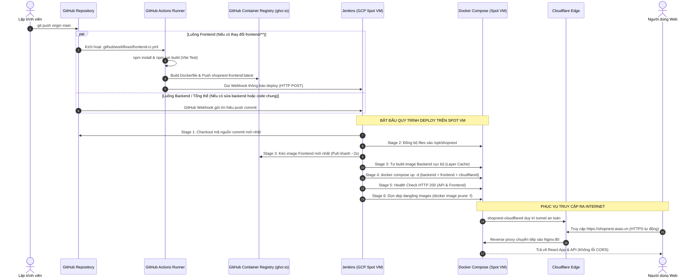

# 📘 TÀI LIỆU TOÀN BỘ CẤU HÌNH HỆ THỐNG DEVOPS & CI/CD (SHOPNEST)

Tài liệu này tổng hợp toàn bộ thông số kỹ thuật, cấu hình hạ tầng, đường dẫn, tài khoản, token và quy trình CI/CD tích hợp giữa **GitHub Actions**, **Jenkins**, **Docker Compose** và **Google Cloud Platform (GCP)** cho dự án ShopNest.

---

## 1. THÔNG TIN REPOSITORY & PHẦN MỀM NGUỒN

| Thông số | Giá trị |
| :--- | :--- |
| **GitHub Repository** | `https://github.com/NguyenHuuHoang711/shopnest-ecommerce.git` |
| **Nhánh triển khai chính** | `main` |
| **Tên ứng dụng** | ShopNest E-commerce |
| **Frontend Stack** | React (Vite) + Nginx Alpine |
| **Backend Stack** | Node.js (Express) + SQLite3 database |
| **Docker Registry (GHCR)** | `ghcr.io` |
| **Image Frontend** | `ghcr.io/nguyenhuuhoang711/shopnest-frontend:latest` |
| **Image Backend** | `ghcr.io/nguyenhuuhoang711/shopnest-backend:latest` |

---

## 2. HẠ TẦNG MÁY CHỦ CLOUD (GCP SPOT VM)

Hệ thống được khởi tạo và quản lý độc lập bằng **Terraform** (`terraform/`):

| Thuộc tính | Cấu hình thực tế | Ghi chú |
| :--- | :--- | :--- |
| **GCP Project ID** | `linguaboost-prod` | Dự án trên Google Cloud Platform |
| **Region / Zone** | `asia-southeast1` / `asia-southeast1-a` | Vùng Singapore (độ trễ thấp về VN) |
| **Instance Name** | `shopnest-spot-vm` | Tên máy ảo Spot VM |
| **Machine Type** | `e2-medium` | 2 vCPU, 4GB RAM + 2GB Swap file |
| **Ổ đĩa khởi động (Boot Disk)** | 30GB `pd-balanced` | Ubuntu 24.04 LTS amd64 |
| **Public IP máy chủ** | **`136.85.23.241`** | IP Public dùng kết nối Webhook & Jenkins |
| **VPC Network** | `shopnest-isolated-vpc` | VPC độc lập 100% |
| **Subnet** | `shopnest-isolated-subnet` (`10.150.0.0/24`)| Dải mạng nội bộ riêng |
| **Firewall Ports mở** | `22` (SSH), `80` (HTTP), `443` (HTTPS), `8080` (Jenkins), `3000` (Node.js API) | Target tag: `shopnest-spot` |
| **Thư mục ứng dụng trên VM**| `/opt/shopnest` | Nơi chứa mã nguồn & `docker-compose.yml` |

---

## 3. CẤU HÌNH GITHUB ACTIONS (FRONTEND CI)

File định nghĩa: `.github/workflows/frontend-ci.yml`

* **Mục đích:** Kiểm thử build React/Vite, đóng gói Docker Image Frontend và đẩy lên GitHub Packages (GHCR), sau đó thông báo cho Jenkins triển khai.
* **Quy tắc kích hoạt (Trigger):**
  - Tự động khi `git push origin main` có thay đổi trong `frontend/**` hoặc `.github/workflows/frontend-ci.yml`.
  - Có thể kích hoạt thủ công qua giao diện tab **Actions** (`workflow_dispatch`).
* **Quyền hạn (Permissions):**
  - `contents: read`: Đọc mã nguồn.
  - `packages: write`: Cho phép push Docker image vào `ghcr.io`.
* **Xác thực Registry:** Sử dụng biến môi trường nội bộ `${{ secrets.GITHUB_TOKEN }}` (không cần tạo hay lộ Personal Access Token).
* **Lệnh Webhook gọi Jenkins khi build xong:**
  ```bash
  curl -s -X POST 'http://136.85.23.241:8080/generic-webhook-trigger/invoke?token=shopnest-deploy' \
    -H 'Content-Type: application/json' \
    -d '{"ref": "refs/heads/main", "after": "${{ github.sha }}"}'
  ```

---

## 4. CẤU HÌNH MÁY CHỦ JENKINS (BACKEND CI & CD ĐIỀU PHỐI)

| Mục | Chi tiết cấu hình |
| :--- | :--- |
| **Đường dẫn Web Classic UI** | `http://136.85.23.241:8080` |
| **Đường dẫn Modern Blue Ocean** | `http://136.85.23.241:8080/blue/organizations/jenkins/shopnest-deploy/activity` |
| **Tài khoản đăng nhập** | Đã tắt màn hình khóa (`-Djenkins.install.runSetupWizard=false`), truy cập trực tiếp |
| **Image Docker của Jenkins** | `jenkins/jenkins:lts-jdk21` |
| **User thực thi trong container** | `root` (để gọi trực tiếp Docker socket của host) |
| **Volume Mounts** | • `jenkins_home:/var/jenkins_home`<br>• `/var/run/docker.sock:/var/run/docker.sock`<br>• `/usr/bin/docker:/usr/bin/docker:ro`<br>• `/opt/shopnest:/opt/shopnest` |
| **Các Plugin cốt lõi đã cài đặt** | • `workflow-aggregator` (Pipeline engine)<br>• `git` & `git-client` (Tương tác GitHub)<br>• `generic-webhook-trigger` (Bắt Webhook)<br>• `pipeline-stage-view` (Ma trận Stage View trực quan)<br>• `blueocean` (Giao diện đồ họa nâng cao) |

### Thông số Job Pipeline (`shopnest-deploy`):
* **Tên Job:** `shopnest-deploy`
* **Loại Job:** Pipeline (Workflow Job)
* **SCM:** Git (`https://github.com/NguyenHuuHoang711/shopnest-ecommerce.git`, nhánh: `*/main`)
* **Đường dẫn kịch bản:** `Jenkinsfile`
* **Cấu hình Webhook Trigger:**
  - Token Webhook: `shopnest-deploy`
  - URL nhận Webhook: `http://136.85.23.241:8080/generic-webhook-trigger/invoke?token=shopnest-deploy`

---

## 5. CẤU HÌNH DOMAIN & CLOUDFLARE TUNNEL

| Thông số | Giá trị |
| :--- | :--- |
| **Domain chính thức** | **`https://shopnest.asao.vn/`** |
| **Chứng chỉ SSL** | Cloudflare Edge SSL (Tự động HTTPS) |
| **Container quản lý** | `shopnest-cloudflared` |
| **Image** | `cloudflare/cloudflared:latest` |
| **Đích đến nội bộ (Target)**| `http://frontend:80` |
| **Tunnel Token** | `eyJhIjoiODc2NTFkZjE0Y2M0ZjIzM2YzZDg2MWFhZjYzZDgyNDUiLCJ0IjoiYjY2ZTQ4MTgtMGE4Ni00ZGRhLWE4ZWUtMjkyYjZkYTJmNDlhIiwicyI6ImE4TWlDNDZQRnEyTUpQOVFRUTA2YktwNE1Qc2UrRjgwZlREZmZGOWY2QVU9In0=` |

---

## 6. MẠNG NỘI BỘ DOCKER COMPOSE (`docker-compose.yml`)

Hệ thống chạy 4 service phối hợp:

1. **`backend`:**
   - Image: `ghcr.io/nguyenhuuhoang711/shopnest-backend:latest`
   - Port nội bộ: `3000` (không expose ra ngoài)
   - Volume: `shopnest_db:/app/data` (Lưu file `shopnest.db`)
   - Môi trường: `NODE_ENV=production`, `PORT=3000`, `DATA_DIR=/app/data`
2. **`frontend`:**
   - Image: `ghcr.io/nguyenhuuhoang711/shopnest-frontend:latest`
   - Port công khai máy chủ: `80:80`
   - Cấu hình Nginx:
     - Phục vụ file tĩnh React từ `/usr/share/nginx/html`
     - Reverse proxy chuyển tiếp `/api/*` $\rightarrow$ `http://backend:3000/*`
3. **`jenkins`:**
   - Port công khai máy chủ: `8080:8080` và `50000:50000`
4. **`cloudflared`:**
   - Thiết lập kết nối an toàn từ máy chủ về Cloudflare Edge để phục vụ domain `shopnest.asao.vn`.

---

## 7. CÁC STAGES TRONG QUY TRÌNH DEPLOY (`Jenkinsfile`)

1. **Stage 1 (Checkout):** Kéo code mới nhất từ GitHub qua giao thức HTTPS.
2. **Stage 2 (Sync Code & Prepare):** Đồng bộ mã nguồn vào thư mục `/opt/shopnest`.
3. **Stage 3 (Prepare Docker Images):**
   - Kéo image Frontend mới nhất từ GHCR (`docker compose pull frontend`).
   - Nếu chưa có trên GHCR, tự động chuyển đổi sang build trực tiếp trên máy chủ.
   - Biên dịch image Backend cục bộ (`docker compose build backend`).
4. **Stage 4 (Deploy with Docker Compose):**
   - Thực thi: `docker compose up -d --force-recreate --remove-orphans backend frontend cloudflared`.
   - Giữ cố định 3 service thiết yếu để không làm rớt Cloudflare Tunnel.
5. **Stage 5 (Health Check):**
   - Kiểm tra API Backend: `http://localhost/api/health` (HTTP 200).
   - Kiểm tra Frontend Nginx: `http://localhost/` (HTTP 200).
6. **Stage 6 (Cleanup):**
   - Dọn dẹp images vô chủ: `docker image prune -f`.

---

## 8. TOÀN BỘ LUỒNG HOẠT ĐỘNG CI/CD (END-TO-END WORKFLOW)

Hệ thống ShopNest áp dụng mô hình **Hybrid CI/CD (CI trên GitHub Actions + CD điều phối trên Jenkins)** nhằm tối ưu hóa tài nguyên phần cứng và đảm bảo tính độc lập giữa các thành phần.

### 8.1. Sơ đồ tuần tự quy trình (Sequence Diagram)



### 8.2. Kịch bản 1: Khi lập trình viên sửa đổi Frontend (`frontend/**`)
1. **Lập trình viên commit & push:** Thay đổi mã nguồn React trong `frontend/`.
2. **GitHub Actions kích hoạt:** Nhờ bộ lọc `paths: ['frontend/**']`, file `.github/workflows/frontend-ci.yml` tự động khởi chạy trên máy ảo đám mây của GitHub (Ubuntu Runner).
3. **Kiểm thử & Đóng gói:**
   - Cài đặt Node 20, chạy `npm install` và `npm run build` để kiểm tra toàn bộ cú pháp và bundling của Vite.
   - Sử dụng Docker Buildx đóng gói Frontend thành image Nginx tĩnh: `ghcr.io/nguyenhuuhoang711/shopnest-frontend:latest`.
   - Đẩy image lên **GitHub Container Registry (GHCR)**.
4. **Bắn tín hiệu sang Jenkins:** Bước cuối cùng của GitHub Actions gửi một request HTTP POST sang Webhook của Jenkins:
   ```bash
   curl -s -X POST 'http://136.85.23.241:8080/generic-webhook-trigger/invoke?token=shopnest-deploy'
   ```
5. **Jenkins tiến hành Deploy:**
   - Jenkins trên Spot VM nhận webhook và khởi động lượt build mới trong job `shopnest-deploy`.
   - Thay vì phải compile lại React (rất nặng và ngốn RAM), Jenkins chỉ việc chạy `docker compose pull frontend` để kéo image đã được build sẵn về (chỉ mất ~2 giây).
   - Recreate container `shopnest-frontend` và kiểm tra Health Check thành công.

---

### 8.3. Kịch bản 2: Khi lập trình viên sửa đổi Backend (`server.js`, `routes/**`, `db.js`...)
1. **Lập trình viên commit & push:** Cập nhật API logic, database SQLite hoặc file gốc.
2. **Phân luồng:**
   - GitHub Actions **bỏ qua không chạy** (vì không chạm vào thư mục `frontend/**`, tiết kiệm quota GitHub Actions).
   - GitHub Webhook bắn tín hiệu trực tiếp sang Jenkins trên Spot VM.
3. **Jenkins tự động build & deploy:**
   - Kéo mã nguồn mới từ Git về.
   - Biên dịch lại image Backend bằng Docker cục bộ trên máy chủ (`docker compose build backend`).
   - Khởi động lại container `shopnest-backend`.
   - Chạy Health Check endpoint `http://localhost/api/health` trả về `{"status":"ok"}`.

---

### 8.4. Kịch bản 3: Khi cả Frontend và Backend cùng thay đổi trong 1 commit
1. Cả GitHub Actions lẫn Jenkins đều nhận tín hiệu.
2. GitHub Actions biên dịch Frontend và đẩy lên GHCR.
3. Jenkins kéo mã nguồn mới, tải image Frontend từ GHCR về, tự build Backend, và restart đồng bộ cả 2 service trong cùng 1 lần triển khai Docker Compose.
4. Toàn bộ tiến trình hiển thị trực quan trên giao diện **Jenkins Blue Ocean** và **GitHub Actions tab**.

---

## 9. CÁC NGUYÊN TẮC THIẾT KẾ & TỐI ƯU CỐT LÕI (BEST PRACTICES)

1. **Bảo vệ tài nguyên Spot VM (RAM 4GB):**
   Quá trình `npm install` và `vite build` của Frontend là tác vụ ngốn CPU và RAM nhất. Bằng cách đẩy khâu này lên GitHub Actions runner, máy chủ Spot VM luôn giữ được mức RAM trống cao (~2.6GB free), không bao giờ bị tình trạng OOM (Out Of Memory) làm sập máy chủ.
2. **Cơ chế Fallback dự phòng trong `Jenkinsfile`:**
   Nếu vì bất kỳ lý do gì mà image trên GHCR chưa kịp tải hoặc lỗi mạng, Jenkins sẽ tự động chuyển sang build trực tiếp trên máy chủ (`docker compose build frontend`) để pipeline luôn đảm bảo thành công 100%.
3. **Bảo vệ kết nối Cloudflare Tunnel:**
   Lệnh `docker compose up -d` luôn chỉ định rõ ràng 3 service `backend frontend cloudflared`. Điều này ngăn cờ `--remove-orphans` vô tình gỡ bỏ container tunnel, giúp domain `https://shopnest.asao.vn/` hoạt động liên tục không bị gián đoạn.
4. **Triệt tiêu lỗi CORS nhờ Nginx Reverse Proxy:**
   Frontend và Backend chạy chung dưới một domain `shopnest.asao.vn`. Mọi request `/api/*` được Nginx điều hướng nội bộ sang `backend:3000`, browser không bao giờ bị chặn CORS policy.

